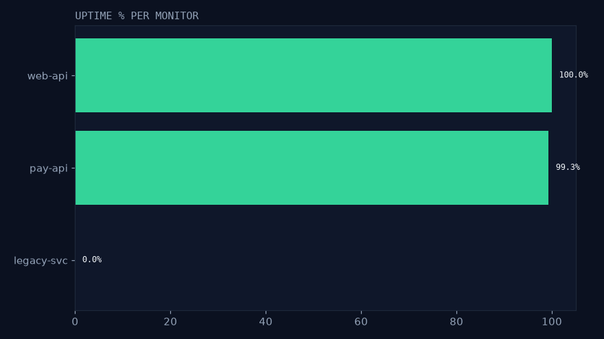
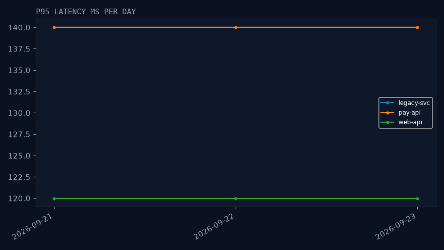
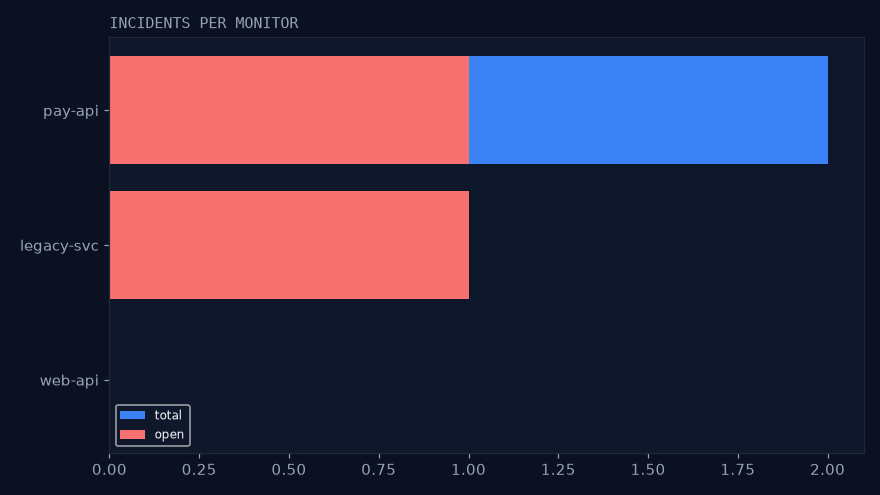
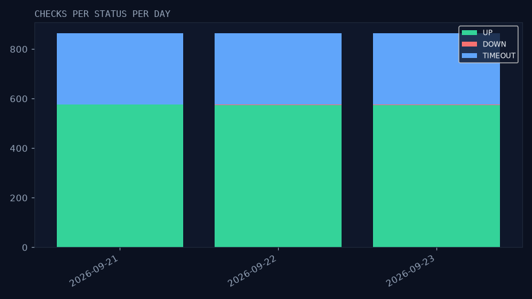

# pulse-data

[](https://github.com/RakhaYandra/pulse-data/actions)

> Ecosystem: [api](https://github.com/RakhaYandra/pulse) · [web](https://github.com/RakhaYandra/pulse-web) · [docs](https://github.com/RakhaYandra/pulse-docs/releases) · [data](https://github.com/RakhaYandra/pulse-data)

Reliability analytics for the [Pulse](https://github.com/RakhaYandra/pulse)
monitoring database — Python + pandas + DuckDB + matplotlib. No server, no deploy.

## Purpose, Output & Expectations

**Purpose.** Raw checks don't tell an operator which service is degrading,
how long incidents really last, or whether monitors keep their schedule.
This pipeline turns checks + incidents into those answers — and cross-checks
uptime/MTTR against the API itself.

**Output.** Deterministic demo data (3 monitors, 2,592 checks, 3 incidents),
4 marts, 4 charts, and a MATCH cross-check between pipeline numbers and
`GET /v1/reports/reliability`.

**Expectations.** After `./run.sh`: same numbers on every fresh scratch DB;
pipeline and API agree within rounding; no dumps or credentials committed.

## Features

| Feature | Description |
|---|---|
| Demo data | - Committed `demo_data.sql`: 3 days, 3 monitors (healthy, flaky, dead) with open + resolved incidents. - Purpose: transparent fixture. Output: reviewable rows. |
| Extract + quality | - Read-only Postgres read (`password_hash` never selected); gates for orphan FKs, blank URLs, bad intervals/timeouts/thresholds, negative latencies, resolved<started, duplicates. - Purpose: trustworthy input. Output: quality report or failed run. |
| Marts | - `uptime_daily`, `incidents_summary`, `status_daily`, `adherence_daily`. - Purpose: reliability answers. Output: 4 marts (DuckDB + parquet in `work/`). |
| Cross-check | - Pipeline uptime/MTTR vs API reliability must MATCH (< 0.01 / < 1s). - Purpose: two implementations, one truth. Output: MATCH line. |
| Charts | - 4 PNGs (uptime, latency, incidents, status). - Purpose: visuals without deploy. Output: committable PNGs. |

## Insight (run demo_data Sep 2026)

* **Uptime: web-api 100.0%, pay-api 99.3% (6/864 failed), legacy-svc 0.0%**
* **MTTR: pay-api 900s** (10:00 → 10:15); 2 incidents still OPEN (pay-api, legacy-svc)
* **Cross-check vs API identik**: pipeline uptime/MTTR = `GET /v1/reports/reliability`
  (same formulas; diff < 0.01 / < 1s)
* **Schedule adherence 100%** all monitors (288/288 expected checks per day)






## Cara run 10 menit

```bash
# 1. Scratch DB + schema (owned by pulse repo) + fixture
createdb -h 127.0.0.1 -p 5433 -U pulse pulsedata   # or reuse the pulse PG
for f in 001_users 002_monitors 003_checks 004_incidents 005_next_run_at; do
  curl -sSfL "https://raw.githubusercontent.com/RakhaYandra/pulse/main/backend/infrastructure/postgres/migrations/$f.sql" \
    | psql -h 127.0.0.1 -p 5433 -U pulse -d pulsedata -q -f -
done
psql -h 127.0.0.1 -p 5433 -U pulse -d pulsedata -q -f demo_data.sql

# 2. Full pipeline (needs PG_* env; cross-check needs a Pulse API on pulsedata)
PG_PASS=pulsepass ./run.sh
PG_PASS=pulsepass PULSE_API=http://localhost:18091 PULSE_USER=demo@pulse.local PULSE_PASS='Demo1234!' ./run.sh
```
